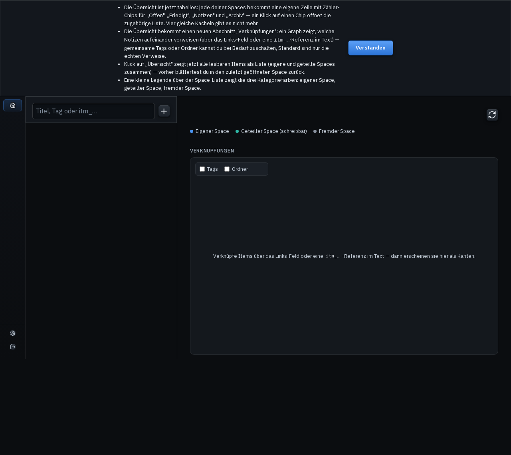
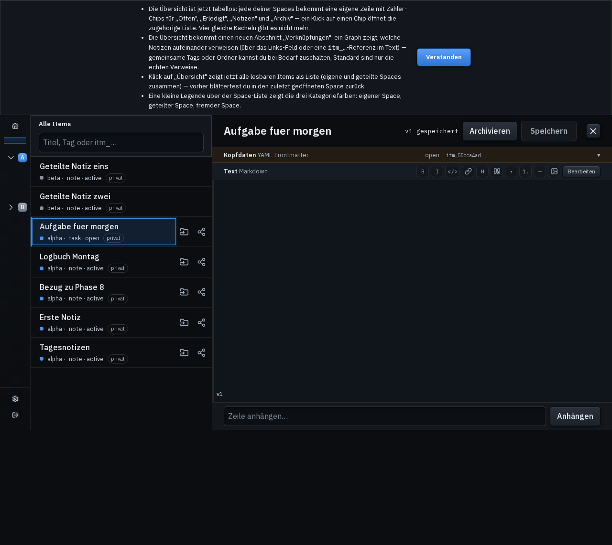
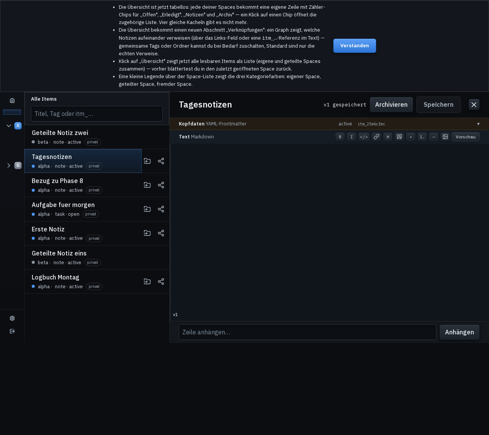
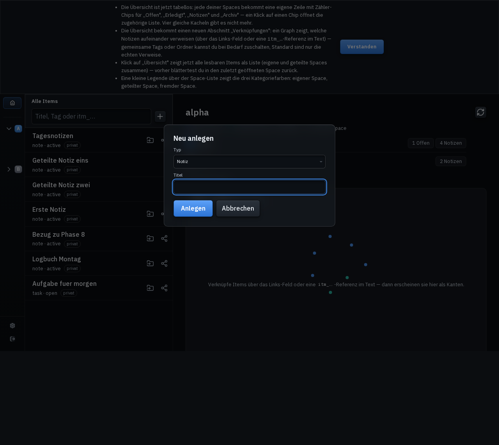
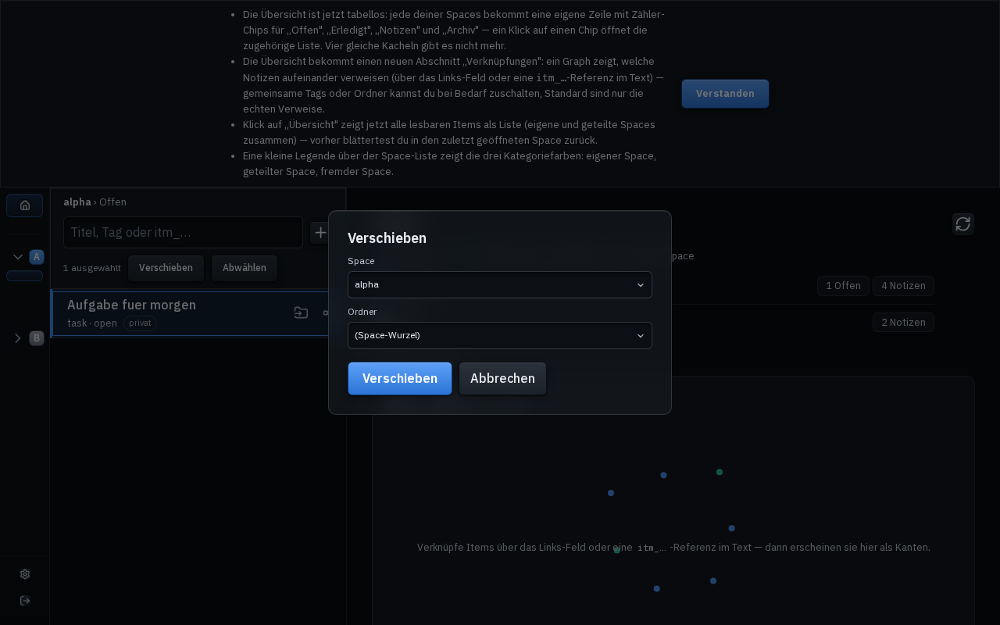
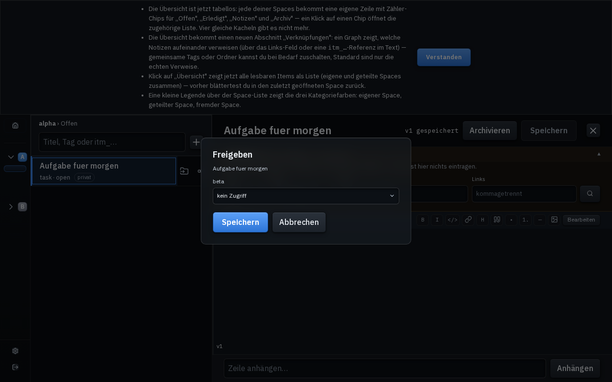

# Space-Server

Ein geteilter Kontext-Speicher für zwei Personen und ihre Claude-Instanzen.

Notizen und Aufgaben liegen als **Markdown-Dateien mit YAML-Frontmatter** in einem
Git-Repository auf einer Heim-VM. Menschen bearbeiten sie im Editor oder (ab Phase 5) in einer
Web-UI. Claude greift über einen **Remote-MCP-Custom-Connector** darauf zu — jeder Nutzer hat
einen eigenen Space, beide dürfen den des anderen lesen.

**Was es nicht ist:** kein Wissensmanagement mit semantischer Suche, keine Cloud-Notizapp, kein
Gedächtnis für Claude. Es ist ein Aktenschrank, den man in jeder Konversation aktiv aufmachen
muss. Claude läuft nicht im Hintergrund und aktualisiert hier nichts von selbst.

## Warum Markdown + Frontmatter statt Datenbank

Drei Gründe, alle praktisch:

1. **Token-Effizienz.** Eine Suche liefert nur die Frontmatter-Felder plus einen kurzen Snippet
   zurück. Dreißig Treffer kosten dadurch wenige hundert Tokens statt Zehntausende. Das `links:`-
   Feld macht daraus einen rudimentären Graph, den Claude gezielt entlangläuft, statt breit zu suchen.
2. **Git ist die Versionierung.** Ein Commit je Schreibvorgang — Historie, Diffs und Undo ohne
   eine einzige Zeile eigenen Codes.
3. **Menschenlesbar.** Wenn der Server ausfällt, sind es immer noch Textdateien in einem
   Verzeichnis. Kein Export nötig, keine Geiselhaft.

SQLite wird trotzdem verwendet — aber ausschließlich als **abgeleiteter Index**, jederzeit
löschbar und aus den Dateien rekonstruierbar.

## Architektur in einem Absatz

```
Claude (Web/Desktop/Mobile)
   │  HTTPS, Verbindung kommt von Anthropics Backend
   ▼
Tailscale Funnel (ausgehend — CGNAT-tauglich, TLS terminiert auf der Node)
   ▼
MCP-Server (Streamable HTTP, Token→Space)      [Phase 2]
   ▼
Storage-Kern: Dateien + Index + Locking        [Phase 1]
   ▲
REST-API + Web-UI für Menschen                 [Phase 5]
```

**Korrektur (2026-07-28, P4 Step 0):** ersetzt Cloudflare Tunnel — P3 hat stattdessen Tailscale
Funnel gebaut (P3-A). Systemd-Unit, `/health`, Request-Log und Backup/Restore aus P3 sind hier
noch keine eigene Zeile, siehe `phase3_edge/CLAUDE.md`.

Der Storage-Kern ist die einzige Komponente, die Daten anfasst. MCP und REST sind zwei dünne
Adapter darüber — deshalb wird der Kern zuerst gebaut und offline bewiesen.

## Sneak Peak — Phase 8 (v3)

Vier Screenshots aus Phase 8 Block C4+C5: Liquid-Glas-Akzente auf Sticky-Head und
Overlays, 3-px-Akzentkante + 1-px-Outline als Auswahl-Sheen, Editor zentriert auf
72ch Lesebreite, `::selection` im eigenen Akzent-Quiet. Gegen eine Wegwerf-Instanz
auf Port 18770 mit sieben Items über zwei Spaces, aufgenommen für die
Nikinger-Sichtprüfung 3 am echten Gerät.

| | |
|:---:|:---|
|  |  |
| Übersicht nach Login: Sticky List-Head mit Crumb, C3-Legende, D2-Graph-Panel im Hintergrund | selektierte Listenzeile mit 3-px-Akzentkante + 1-px-Outline + Backdrop-Sheen (sichtbar bei aktivem Blur) |
|  |  |
| Editor-Spalte zentriert auf 72ch Lesebreite (576px in der 836px-Spalte, kein Vollbreiten-Flattern) | Anlege-Dialog als Liquid-Glas-Träger (`--glass-bg` semi-transparent + Backdrop-Blur, Fallback solide bei `prefers-reduced-transparency`) |

**Nachtrag, Auswahl-Chevron-Vorbild (für Nikinger-Sichtprüfung 3, zusammen mit den vier
Bildern oben zu bewerten):** zwei weitere Screenshots, gegen dieselbe Wegwerf-Kategorie
(Port 18771) aufgenommen, **inklusive** der zwei Vormerkung-3-Fixes dieser Session
(Chevron-Größe/-Position jetzt `em`-skaliert statt fest 12px, `<select>`-Fokus-Rand nur
noch rechts/unten in Akzentfarbe).

| | |
|:---:|:---|
|  |  |
| Verschieben-Dialog: Space- und Ordner-Auswahl, beide mit sichtbarem Chevron rechts | Freigabe-Dialog: Per-Item-Share-Row mit demselben `<select class="input">`-Vorbild |

Hinweis: die Screenshots wurden **vor** dem Phase-8-Block-C4+C5-Live-Deploy gemacht
und zeigen den Stand des lokalen Working-Trees. Die Block-D-Screenshots
(`docs/screenshots/sp2_*`, tabellose Übersicht im Detail + Force-Graph mit
Tag-Toggle/Ordner-Toggle/Knoten-Klick) und die Block-C-Screenshots
(`docs/screenshots/01_login.png` … `09_overview_clean.png`, mit Kachel-Grid) bleiben
als historische Referenz im Verzeichnis, sind aber **nicht** mehr der aktuellste
Stand — wer die volle Übersicht sehen will, schaut oben für C4+C5, dann auf die
`sp2_*`-Bilder für den Verknüpfungs-Graph im Detail.

## Setup

> **Stand 2026-08-02:** Phasen 1–4 (Storage-Kern, MCP-Server, Exposure & Betrieb, OAuth 2.1 +
> DCR) sind abgeschlossen und live-verifiziert — Phase 3 zuletzt, mit dem Restore-Nachweis
> (`restore_check.sh`, `docs/concepts/phase3_edge_plan.md`) als letzter offener Abnahmezeile.
> Phase 4s Schnitt ist vollzogen, der Connector läuft ausschließlich über OAuth 2.1 + DCR, der
> Pfad-Token existiert nicht mehr — und mit ihm nicht mehr die Skripte, die ihn ausgaben (siehe
> unten). **Phase 5 (Web-UI, REST-API, Auth-Selbstverwaltung) ist gestartet**, Plan:
> `docs/concepts/phase5_ui_plan.md`. Siehe Root-`CLAUDE.md` „Current state" für den
> verbindlichen aktiven Phasenstand.

```bash
python -m venv .venv && source .venv/bin/activate
./scripts/dev_install.sh          # editable installs aller Phasenpakete
pytest                            # gemockt, kein Netz
```

**Datenverzeichnis** (`DATA_ROOT`) ist ein **eigenes Git-Repository**, getrennt vom Code-Repo.
Es wird nie in dieses Repo eingecheckt.

**Secrets** liegen ausschließlich im OS-Keyring (Service `nikinger-space`) bzw. als systemd
`LoadCredential`. Nicht in `.env`, nicht in einer Config, nicht in einer Shell-Variable. Wenn
irgendwo in diesem Projekt ein Token in einer Datei auftaucht, ist das ein Incident.

## Anmeldung: OAuth 2.1 + DCR (ab Phase 4)

**[2026-08-02 Korrektur, P5 Step 0]** Dieser Abschnitt beschrieb bis P5 den **Pfad-Token** aus
P2 (`issue_token.py`, `export_space_map.py`, `spaces.cred`). Seit dem P4-Schnitt verbindet sich
niemand mehr darüber — beide Token waren live widerrufen, `TokenPathASGI` (der Code, der sie
akzeptierte) war entfernt. Mit dem P5-Rückbau (`docs/concepts/PHASE4_CLOSEOUT_HANDOVER.md` §4.5)
sind jetzt auch die Skripte selbst sowie die zugehörige `LoadCredentialEncrypted`-Zeile
gelöscht — es gibt keinen Weg mehr zurück zum Pfad-Token, auch nicht als totes Bestandswerkzeug.

Die echte Anmeldung läuft über **OAuth 2.1 + DCR** (Passwort + TOTP): Erstvergabe über
`provision_user.py`, Betrieb über `authctl.py` (Sperren/Entsperren, Widerruf), siehe
`phase4_auth/CLAUDE.md` — Runbook „Inbetriebnahme". **P5 baut zusätzlich eine
Selbstverwaltung** (Einladungslink, Passwort/TOTP/Recovery-Codes im Browser setzen, ohne SSH
und ohne Neustart) — bis dahin bleibt `authctl.py`/SSH der einzige Weg,
`docs/concepts/phase5_ui_plan.md` §2.8.

## MCP-Server smoke-testen

```bash
python phase2_mcp/scripts/mcp_smoke.py            # Text-Report
python phase2_mcp/scripts/mcp_smoke.py --json     # maschinenlesbar auf stdout
```

Baut ein **temporäres** `DATA_ROOT` (nie das echte), zwei Fixture-Spaces und zwei Tokens, die
nur in diesem Lauf existieren — der echte Keyring (Service `nikinger-space`) bleibt unangetastet.
Fährt die sechs Tools einmal komplett durch (beide Rule-4-Fälle: fremd lesen mit Wrap, fremd
schreiben mit `write_denied`) und misst die Antwortgröße je Aufruf. Exit-Code `0` nur, wenn alle
Prüfungen grün sind.

Lokal ohne Tunnel starten (Phase 3 baut die öffentliche Erreichbarkeit):

```bash
SPACE_DATA_ROOT=/pfad/zu/einem/testverzeichnis \
SPACE_PUBLIC_BASE_URL=https://localhost.example \
SPACE_AUTH_DB=/tmp/sharefyx-dev-auth.sqlite3 \
python phase2_mcp/scripts/serve.py
curl http://127.0.0.1:8765/health
```

**[2026-07-30 Korrektur, Schnitt (Runbook-Schritt 8)]** Ersetzt den vorigen Stand („ohne
`SPACE_AUTH_MODE` bleibt dieser Start der P3-Pfad", P4 Step 6b): `TokenPathASGI`/`AuthModeASGI`
sind entfernt, `create_app()` verlangt jetzt immer ein `OAuthConfig`-Bündel — auch ein lokaler
Testlauf ohne Tunnel braucht `SPACE_PUBLIC_BASE_URL` (ein beliebiger `https://`-Platzhalter, wird
nicht kontaktiert) und einen DB-Pfad (`SPACE_AUTH_DB` oder `STATE_DIRECTORY`). `/mcp` selbst ist
darüber nicht per `curl` testbar (braucht einen echten Bearer-Token) — dafür ist
`mcp_smoke.py` da, das seinen eigenen Token direkt gegen eine temporäre `AuthStore` ausstellt.
Details zum OAuth-Modus (nur noch `oauth`, seit dem Schnitt): `phase4_auth/CLAUDE.md`.

**Nebeneffekt, der vorher nicht existierte:** `serve.py` ruft `load_users()` jetzt **immer** auf
(vorher nur, wenn `SPACE_AUTH_MODE` gesetzt war). Außerhalb von systemd (kein
`CREDENTIALS_DIRECTORY`) fällt das auf den **echten** Keyring (Service `nikinger-space`) zurück
— ein lokaler `serve.py`-Lauf auf dieser Maschine liest damit echte Nutzerakten, auch wenn er nie
einen Login-Versuch bekommt. Kein Schreibzugriff, aber ein neuer Lesezugriff, den es vor dem
Schnitt nicht gab.

## Bewusst akzeptierte Kompromisse

Damit sie niemand später „entdeckt" und für einen Bug hält:

- **Keine Ende-zu-Ende-Verschlüsselung.** Der Server muss lesen können, damit Claude lesen kann.
  **[2026-07-28]** Seit P3 läuft der Weg über Tailscale Funnel, die Node terminiert TLS selbst —
  kein Relay-Betreiber sieht mehr Klartext, aber Tailscale bleibt vertrauenswürdige
  Infrastruktur (R4).
- **Bearer-Token bleiben Bearer-Token.** **[2026-07-30]** Löst den vorigen Satz über den Token
  in der URL ab (Phase 4, Schnitt vollzogen — der Pfad-Token existiert nicht mehr). RFC 9700
  empfiehlt Sender-Constraining über DPoP oder mTLS; der Client unterstützt beides nicht. Ein
  abgeflossener Access-Token ist bis zu 60 Minuten nutzbar, ein Refresh-Token bis zur nächsten
  Rotation. Gegenmittel und ihre Grenze: kurze Lebensdauer, Rotation mit Reuse-Erkennung,
  sofortige Widerrufbarkeit über `authctl.py` (Plan §9 Risiko 3).
- **Single Point of Failure.** Eine VM an einem Mobilfunk-Uplink. Fällt sie aus, zeigt Claude
  nur „Disconnected".
- **Kein Hintergrundgedächtnis.** Siehe oben — Claude muss in jeder Konversation angewiesen
  werden, den Space zu lesen.

Details und Begründungen: `CLAUDE.md` → „Current state" → Rahmenentscheidungen R1–R6.

## Eingefrorene Schreibweisen (Nikinger-Entscheidung, 2026-07-25)

Drei uneinheitliche Schreibweisen für denselben Ort sind **bewusst eingefroren, nicht
„repariert"**: Repo/Drive heißt `sharefyx`, VM-Pfade beginnen mit `/home/savefyx/…`, das
Code-Repo-Verzeichnis heißt `/home/savefyx/dev/savefxy` (Buchstabendreher gegenüber den beiden
anderen). Ebenso: `DATA_ROOT` steht auf Branch `master`, das Code-Repo auf `main` — kosmetisch,
kein Remote betroffen. Eine Umbenennung jetzt würde Pfade brechen, die Phase 3 wortwörtlich in
systemd-Units schreibt. Wer eine dieser Schreibweisen antastet, macht eine Scope-Entscheidung,
keine Aufräumarbeit.

## Navigation

Alle Dokumente sind in [`docs/INDEX.md`](./docs/INDEX.md) verzeichnet. Der Phasenplan steht in
[`ROADMAP.md`](./ROADMAP.md), die Arbeitsregeln in [`CLAUDE.md`](./CLAUDE.md).
